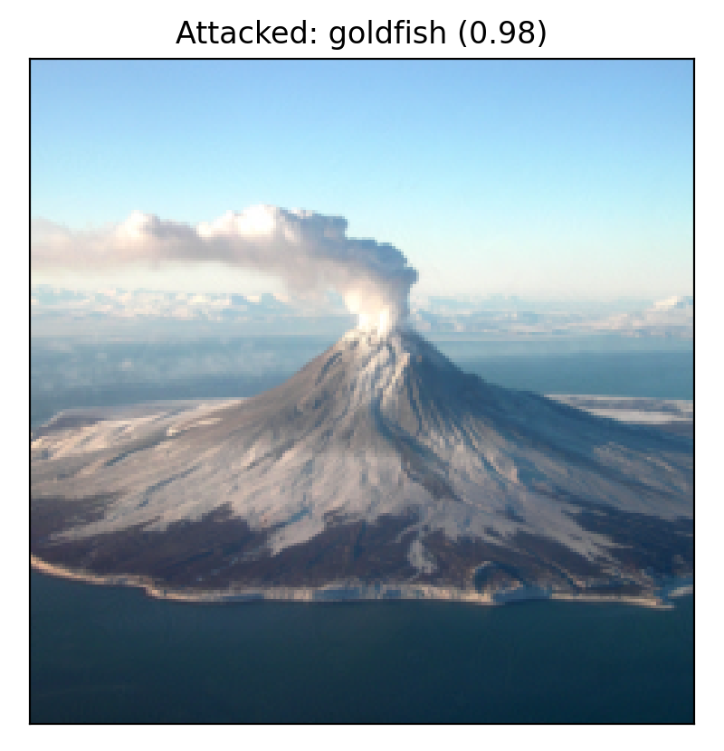

# Adversarial machine learning

This repository contains an exploration of adversarial attacks and defenses.
Some simple gradient-driven attacks are implemented and tested.
Moreover, a demonstration of adversarial training is given.
It uses adversarial examples during training in order to robustify the model.

Everything here is implemented with PyTorch and Lightning.
The dedicated [ART](https://github.com/Trusted-AI/adversarial-robustness-toolbox)
library is employed in addition to that.
It provides a unified NumPy-based API for adversarial ML that,
under the hood, supports all major deep learning frameworks.

<p>
  
  
</p>


## Notebooks

- [Introduction](notebooks/intro.ipynb)

- [Adversarial attacks (ART)](notebooks/adv_attacks_art.ipynb)

- [Adversarial attacks (PyTorch)](notebooks/adv_attacks_pt.ipynb)

- [Adversarial attacks (Hugging Face)](notebooks/adv_attacks_hf.ipynb)

- [Adversarial training (Hugging Face)](notebooks/adv_train_hf.ipynb)


## Installation

```
pip install -e .
```


## Training

```
python scripts/main.py fit --config config/std_train.yaml
```

```
python scripts/main.py fit --config config/adv_train.yaml
```

